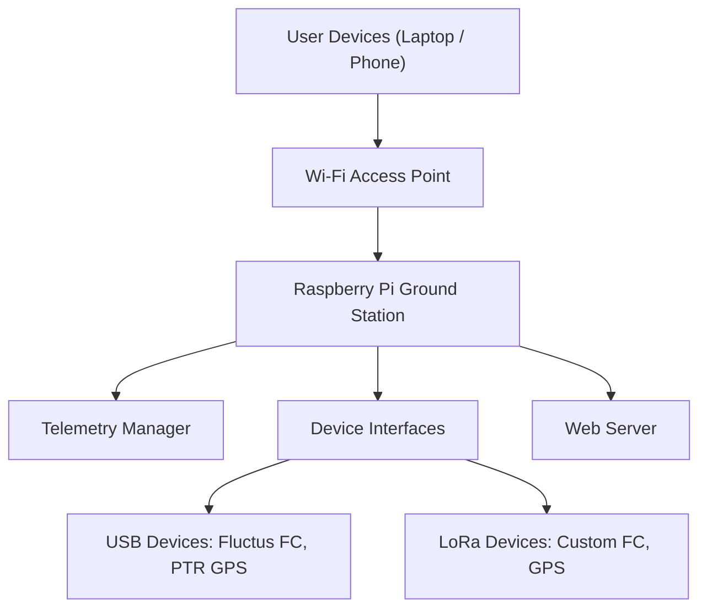

# <Project Name> Ground Station

A modular, Raspberry Pi–based ground station system designed to aggregate telemetry from multiple flight and tracking devices and present it through a live, multi-user web interface.

The system runs on a Raspberry Pi configured in **Access Point (AP) mode**, allowing users to connect directly via Wi-Fi and view real-time telemetry without requiring external network infrastructure.

---

## Features

- 📡 **Multi-Device Telemetry Collection**
- 🌐 **Live Web-Based Dashboard**
- 📶 **Raspberry Pi Access Point Mode**
- 🔌 **USB and LoRa Device Support**
- 🧩 **Easily Expandable Architecture**
- 👥 **Multiple Simultaneous Users**

---

## Supported Devices

The ground station currently supports the following devices:

### Custom Flight Computer (LoRa)
- Communicates via **LoRa**
- Receives real-time flight telemetry
- Designed to integrate seamlessly with the ground station’s radio interface

### Fluctus Flight Computer (USB)
- Direct **USB serial connection**
- Automatically detected and parsed
- Supports live telemetry streaming
- [Protocol documentation](https://silicdyne.net/docs/fluctus/downloads/)

### PTR GPS Tracker (USB / LoRa)
- USB serial support
- Optional LoRa support (configurable)
- Provides GPS position, altitude, and tracking data

---

## System Architecture Overview

---

## Web Interface

- Accessible via any device connected to the Raspberry Pi’s Wi-Fi network
- Displays:
  - Live telemetry data
  - Device status and connection health
  - GPS location (when available)
- Supports **multiple concurrent users**
- No internet connection required

---

## Expandability

This project is designed to make adding new devices straightforward.

To add a new device:
1. Implement a new **device interface module**
2. Define:
   - Connection type (USB / LoRa / other)
   - Data parsing logic
3. Register the device with the telemetry manager

The rest of the system (web UI, data distribution, logging) will automatically handle the new data source.

---

## Requirements

### Hardware
- Raspberry Pi (recommended: Pi 4 or newer)
- USB ports for connected devices
- LoRa module (for wireless devices)
- Supported flight computers / trackers

### Software
- Linux (Raspberry Pi OS recommended)
- Python 3.x
- Web browser (client-side)

---

## Setup Overview

1. Configure the Raspberry Pi in **Wi-Fi Access Point mode**
2. Connect supported devices via USB or LoRa
3. Start the ground station software
4. Connect to the Pi’s Wi-Fi network
5. Open the web interface in a browser

> Detailed setup instructions will be provided in the `/docs` directory.

---

## Project Goals

- Provide a **reliable, portable ground station**
- Reduce setup complexity during launches
- Support **multiple teams and devices simultaneously**
- Enable future expansion without major refactoring

---

## Contributing

Contributions are welcome from club members!

- Follow the modular device interface pattern
- Document new devices and protocols
- Test changes with real hardware when possible

---

## License

GNU GENERAL PUBLIC LICENSE

